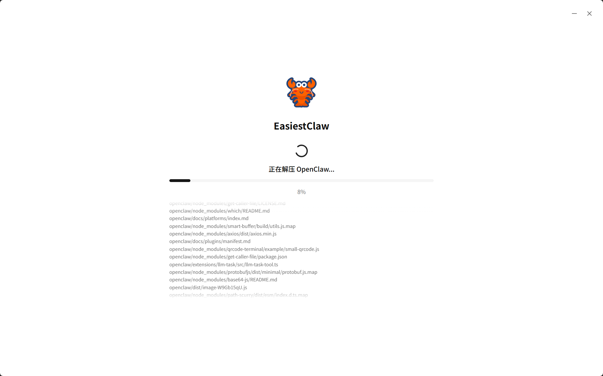
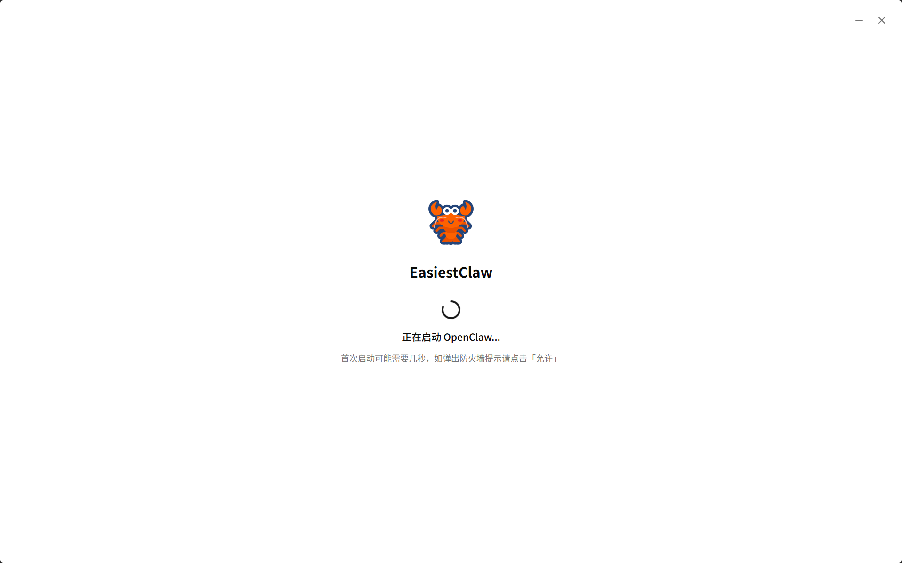
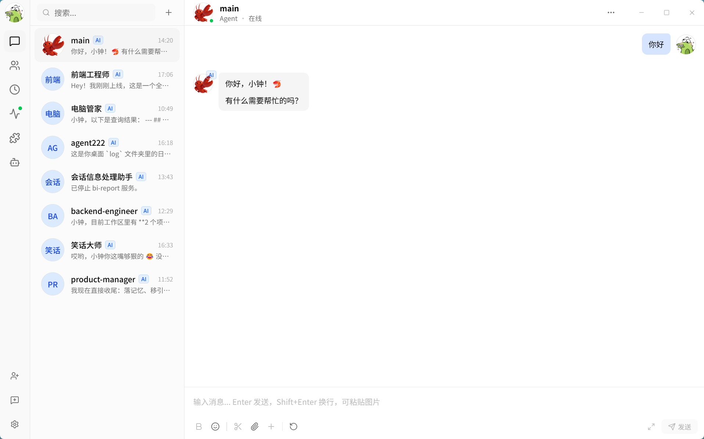
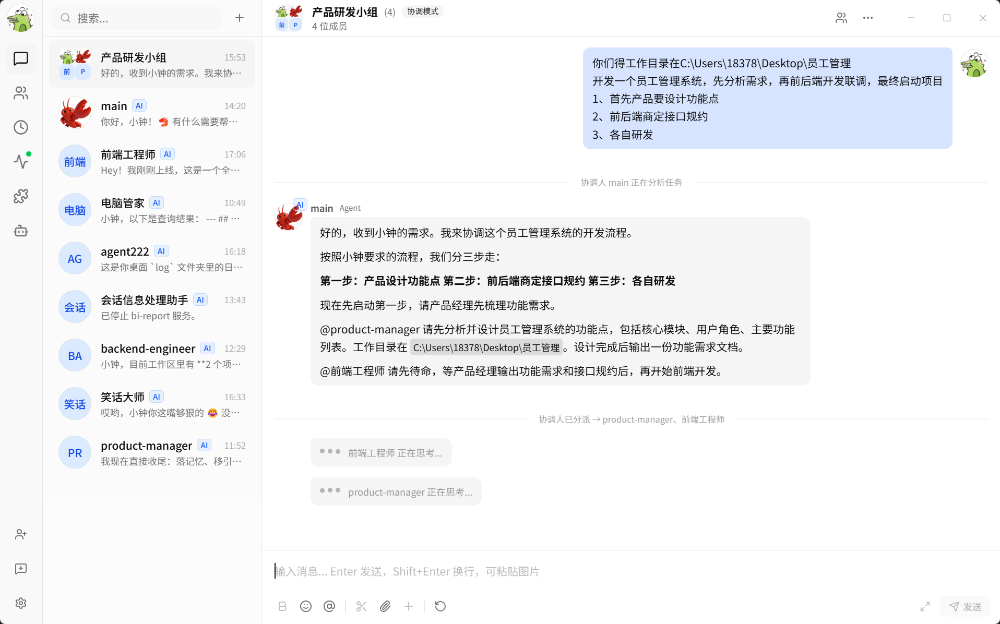
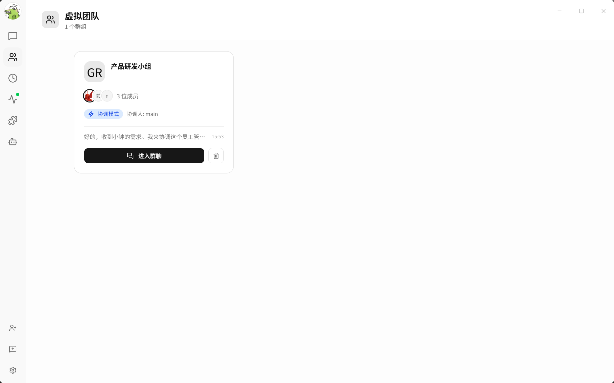
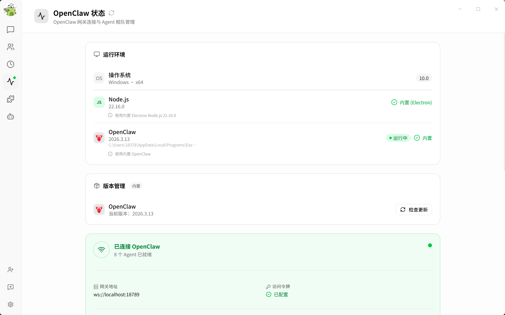
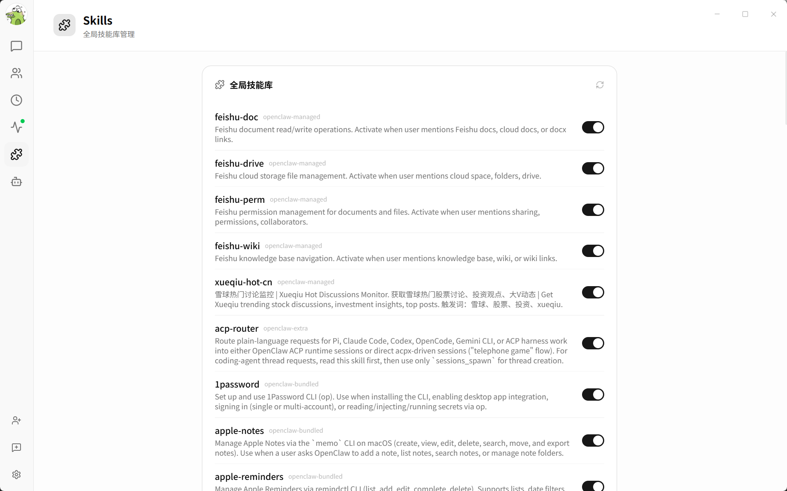
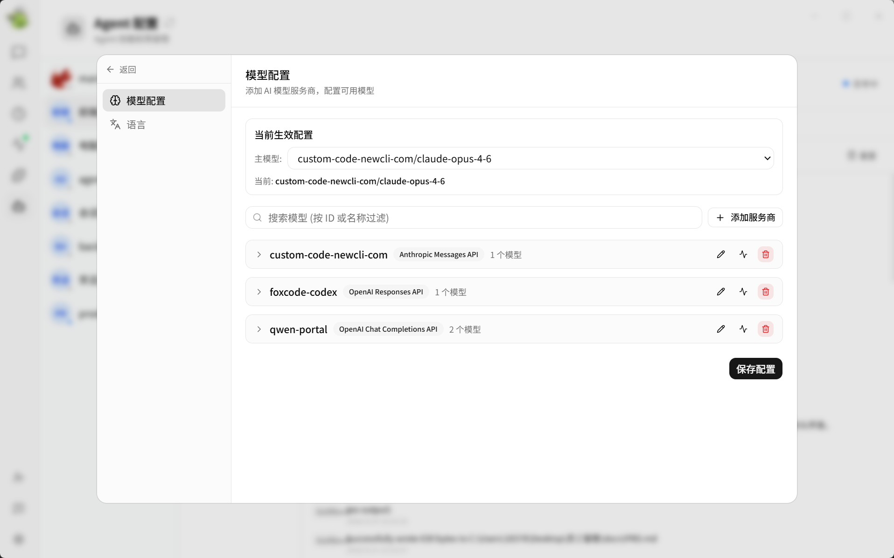

<div align="center">

# EasiestClaw Desktop

**OpenClaw 的桌面端 GUI — 无需写代码，即可运行你自己的 AI 团队。**

[](LICENSE)
[](https://github.com/Zmmmmy/easiest-claw/releases)

[下载安装包](#下载) · [开发指南](#开发)

</div>

---

## 简介

EasiestClaw 是一款基于 Electron 的桌面应用，为 **OpenClaw** AI 智能体网关提供图形化操作界面。它内置了完整的 OpenClaw 运行时，安装即用，无需额外安装 Node.js 或在终端执行任何命令，任何人都可以通过一个 `.exe` 或 `.dmg` 启动属于自己的 AI 虚拟团队。

> **什么是 OpenClaw？**
> OpenClaw 是一个 AI 智能体编排网关，支持运行、调度和协调多个 AI 智能体（可对接任意 LLM 提供商），通过统一的 WebSocket API 进行管理。

## 功能特性

- **开箱即用，零依赖** — 内置 Node.js 运行时与 OpenClaw 网关，首次启动自动解压，无需系统预装 Node.js
- **AI 虚拟团队** — 创建和管理 AI 智能体舰队，支持单独私聊（DM）或创建多智能体协作的群组会话
- **定时任务** — 类 Cron 的周期性任务调度，自动触发智能体执行
- **多模型多供应商** — 在界面中直接配置 OpenAI、Anthropic、DeepSeek 及任意兼容 OpenAI 的模型供应商
- **文件与图片附件** — 拖拽图片或文件发送至对话，图片直接内联发送给模型
- **流式响应** — 所有智能体回复实时逐 token 流式输出
- **应用内更新** — 直接在应用内检查并升级 OpenClaw 网关，无需重装客户端
- **外部网关支持** — 可连接到本地或远程运行的 OpenClaw 实例

## 安装

















## 下载

前往 [**Releases**](https://github.com/Zmmmmy/easiest-claw/releases) 页面下载最新版本：

| 平台 | 文件 |
|------|------|
| Windows (x64) | `EasiestClaw-Setup-x.x.x.exe` |
| macOS | 暂未提供，敬请期待 |

## 开发

### 环境要求

- [Node.js](https://nodejs.org/) 18+
- [pnpm](https://pnpm.io/) 9+

### 本地启动

```bash
# 克隆仓库
git clone https://github.com/Zmmmmy/easiest-claw.git
cd easiest-claw

# 安装依赖
pnpm install

# 打包内置 OpenClaw 运行时（首次必须执行）
node scripts/bundle-openclaw.mjs

# 启动开发服务器（支持热重载）
npm run dev
```

> `bundle-openclaw` 步骤会从 npm 下载 OpenClaw 包并写入 `build/` 目录。只需执行一次，升级 OpenClaw 版本时重新执行即可。

### 常用命令

| 命令 | 说明 |
|------|------|
| `npm run dev` | 启动 Electron 开发服务器（热重载） |
| `npm run build` | 编译主进程 / 预加载 / 渲染进程 |
| `npm run lint` | 对 `.ts` / `.tsx` 文件执行 ESLint |
| `npm run build:win` | 打包 Windows 安装包（NSIS） |
| `npm run build:mac` | 打包 macOS 安装包（DMG） |
| `npm run build:linux` | 打包 Linux 安装包（AppImage） |

编译产物输出至 `out/`，安装包输出至 `dist/`。

## 项目结构

```
src/
├── main/               # Electron 主进程
│   ├── index.ts              — BrowserWindow、IPC 注册、网关启动
│   ├── gateway/
│   │   ├── adapter.ts        — OpenClaw WebSocket 客户端（协议 v3、认证、请求复用）
│   │   ├── bundled-process.ts — 内置网关进程的 fork 与生命周期管理
│   │   ├── runtime.ts        — 适配器单例
│   │   └── settings.ts       — 读写 ~/.openclaw 配置
│   └── ipc/                  — IPC 处理器：chat、agents、config、cron、settings、update …
├── preload/
│   └── index.ts        # contextBridge → window.ipc（类型为 IpcApi）
└── renderer/
    └── src/
        ├── store/            — useReducer 全局状态（会话、消息、智能体、连接）
        ├── hooks/            — useRuntimeEventStream、useAgentFleet、useSendMessage …
        ├── pages/            — chat、cron、virtual-team、settings、openclaw …
        └── components/       — UI 基础组件（shadcn/ui）+ 业务组件
```

## 技术栈

| 层级 | 技术 |
|------|------|
| 桌面框架 | [Electron 35](https://electronjs.org/) |
| 构建工具 | [electron-vite 3](https://electron-vite.org/) |
| UI 框架 | [React 19](https://react.dev/) |
| UI 组件库 | [shadcn/ui](https://ui.shadcn.com/) |
| 样式 | [Tailwind CSS v4](https://tailwindcss.com/) |
| 编程语言 | TypeScript 5 |
| 包管理器 | pnpm 9 |
| AI 网关 | [OpenClaw](https://github.com/openclaw/openclaw) |

## 贡献指南

欢迎提交 Issue 和 Pull Request！建议先开 Issue 讨论再动手修改。

1. Fork 本仓库，创建功能分支（`git checkout -b feat/my-feature`）
2. 按现有代码风格进行修改
3. 确保 `npm run lint` 通过
4. 提交 Pull Request，附上清晰的改动说明

## 致谢

- [MossCompany/mossc](https://github.com/MossCompany/mossc) — 本项目的 UI 设计参考了该项目，感谢其开源
- [OpenClaw](https://github.com/openclaw/openclaw) — 本项目基于 OpenClaw AI 智能体网关构建
- [shadcn/ui](https://ui.shadcn.com/) — UI 组件库
- [electron-vite](https://electron-vite.org/) — Electron 构建工具

## 许可证

[MIT](LICENSE) © EasiestClaw Contributors
